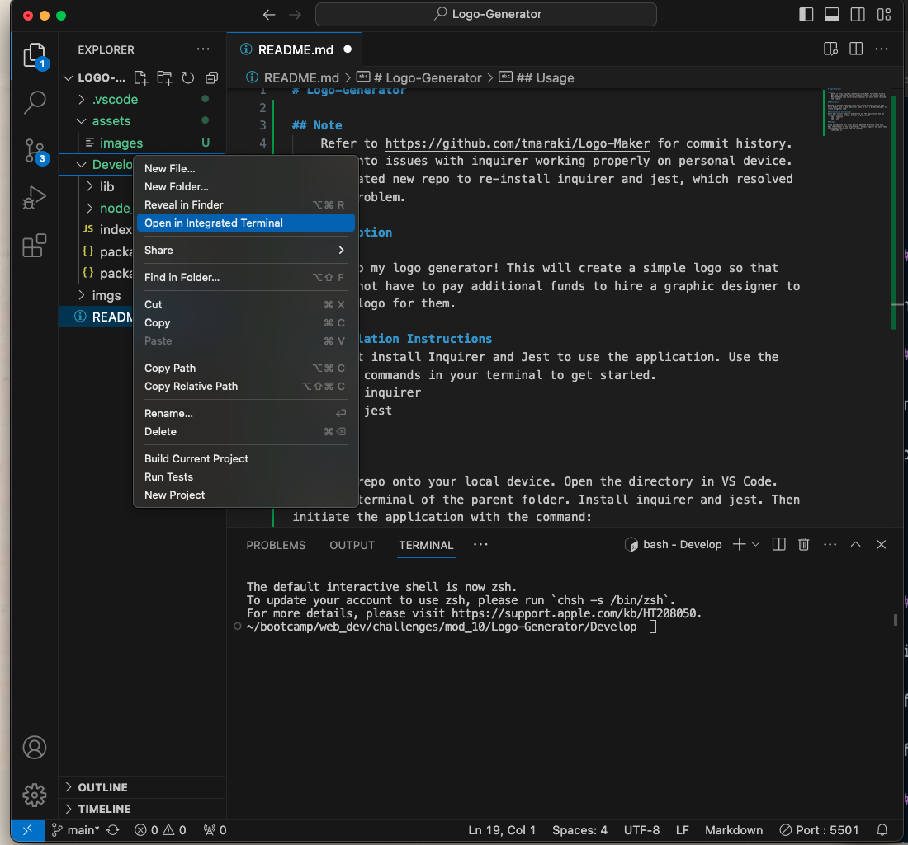

# Logo-Generator

## Note
    Refer to https://github.com/tmaraki/Logo-Maker for commit history. Ran into issues with inquirer working properly on personal device. Recreated new repo to re-install inquirer and jest, which resolved the problem. 

## Description

Welcome to my logo generator! This will create a simple logo so that users do not have to pay additional funds to hire a graphic designer to create a logo for them. As part of the Coding Bootcamp put on my MSU, this is one of the challenges we were tasked to create from scratch.

## Installation Instructions
Users must install Inquirer and Jest to use the application. Use the following commands in your terminal to get started.
    
    npm i inquirer
    npm i jest

## Usage

Clone my repo onto your local device. Open the directory in VS Code. Open the terminal of the parent folder. Install inquirer and jest. Then initiate the application with the command:
    
    node index.js

Refer to the screenshot below ("terminal") for selecting the correct folder to open the terminal

Here is a walk through video: https://drive.google.com/file/d/19Wfd2AFQk1LGOa0srRqRM2b63M_lbfIe/view?usp=sharing

## Credits
- Huge shout out to Thomas Calle! He created a youtube video and shared his repo for beginners, like myself, to reference:
    https://github.com/ThomasCalle/Thomas-Object-Oriented-Programming-SVG-Logo-Maker

- Multiple tutor sessions and one-on-one Q&A with my instructor also contributed greatly to the success of this application. 

## Challenges
The biggest challenge was getting Inquirier to work properly on my device. I continued to receive error messages that required me to import inquirer instead. With the help of my instructor, I was able to work around the issue that we both believed was a personal device issue in how my system and preferences were set up. 

## Lessons Learned
Starting from scratch as a new developer is difficult. So, I started with what I knew which meant reviewing class materials. Thomas Calle's repo helped to fill in the gaps. Many testing and debugging helped to better improve my application and get it in working order. 

## License
This application is not covered by a license.

## Contribution
For any feedback, comments or ways to improve this application, please email me at toshiemaraki@gmail.com

